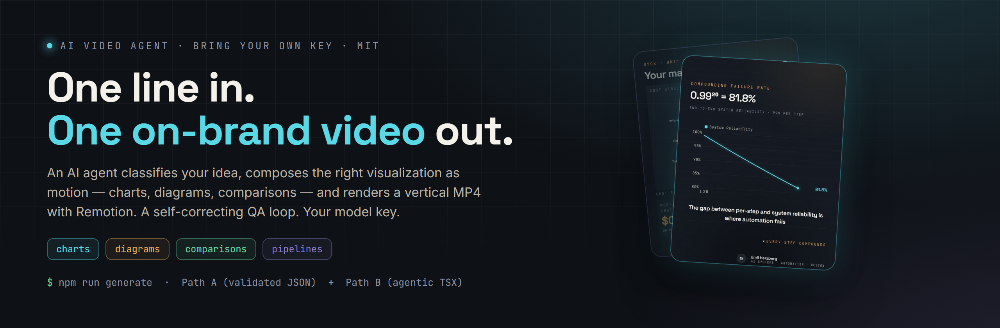
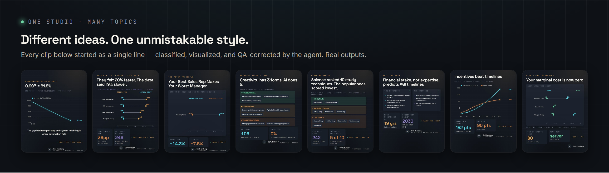

<p align="center">
  <a href="https://ai-videos.herzberg-dynamics.de/">
    
  </a>
</p>

<p align="center">
  <a href="https://ai-videos.herzberg-dynamics.de/"><b>▶&nbsp; Live showcase — watch real generated videos at ai-videos.herzberg-dynamics.de&nbsp;→</b></a>
</p>

# infographic-generator-agent

**Turn a one-line brief into an on-brand animated video.** An AI agent classifies your idea, composes
the right visualization — charts, diagrams, comparisons — as motion, and renders an MP4 with
[Remotion](https://remotion.dev) at **4:5 portrait (default), 1:1 square, or 9:16 vertical**
(`--format`). Bring your own model key — DeepSeek, OpenAI,
Anthropic, Gemini, Vertex, or any OpenAI-compatible endpoint. One consistent visual style, every output.

There are two engines:

- **Path A** — the model emits a *validated JSON spec* that a fixed, layout-safe renderer draws. Cheap,
  deterministic, fast (typically ~2 QA iterations). No model-authored code runs.
- **Path B** — the model *writes a real React/Remotion component* and self-corrects it through a headless
  QA gate (overflow, collisions, mobile floors) until it passes. More creative; it executes
  AI-generated code locally (see [SECURITY.md](SECURITY.md)).

## What it produces

<p align="center">
  
</p>

<p align="center"><sub>Real outputs. Each started as a single line; the agent classified it, picked the visual form, and QA-corrected the layout.</sub></p>

## Quick start

```bash
git clone https://github.com/EmilHerzberg/infographic-generator-agent && cd infographic-generator-agent
npm install
npx playwright install chromium      # the QA inspector renders headlessly
cp .env.example .env                 # then add ONE provider key (see below)
```

**Generate a video from a brief.** Both engines drive the headless QA inspector, so start the dev server
first and leave it running:

```bash
npm run dev            # terminal A — the QA / preview harness (keep running)
```

Then, in a second terminal:

```bash
# Path A — the model emits a validated JSON spec; a fixed, layout-safe renderer draws it, QA-gated.
npm run render -- --provider deepseek --motion \
  --brief "Reliability compounds: 99% per step is 81.8% over twenty steps." --id reliability
# → writes src/posts/generated/reliability.render.json; then render the MP4:
npm run remotion:render:gen -- reliability out/reliability.mp4

# Path B — the agent WRITES and self-corrects a real React/Remotion component,
# then renders the MP4 automatically once it passes the gates.
npm run agent -- --provider deepseek --motion \
  --brief "Reliability compounds: 99% per step is 81.8% over twenty steps." --id reliability
```

> **`--motion` is what produces video.** Without it, Path B emits a still PNG (`out/<id>.png`) and Path A a
> single static frame. (`npm run generate` is a legacy, spec-only command — use `npm run render` for Path A.)

**Preview / inspect a post.** The dev server above is a headless QA harness, not a landing page — open a
specific post by id:

```
http://localhost:5173/?id=reliability
```

With no `?id=` it shows an "unknown post id" helper listing the registered ids. The polished gallery lives
at the [live showcase](https://ai-videos.herzberg-dynamics.de/).

## Providers

You only need the key for the provider you pass to `--provider`. Set it in `.env`:

| `--provider` | env var(s)                                     | default model     |
|--------------|------------------------------------------------|-------------------|
| `deepseek`   | `DEEPSEEK_API_KEY`                             | `deepseek-v4-pro` |
| `openai`     | `OPENAI_API_KEY`                              | `gpt-5.5`         |
| `anthropic`  | `ANTHROPIC_API_KEY`                           | `claude-opus-4-8` |
| `gemini`     | `GEMINI_API_KEY`                              | `gemini-3.1-pro-preview` |
| `vertex`     | `GOOGLE_VERTEX_API_KEY` *or* a service account | `gemini-3.1-pro-preview` |
| `compatible` | `COMPATIBLE_API_KEY` (+ `COMPATIBLE_BASE_URL`) | `openrouter/auto` |

`openai` is the **official** OpenAI API; `compatible` is **any OpenAI-compatible endpoint** (OpenRouter,
Ollama, LM Studio, vLLM, …). Override the model with `--model <id>` or the `<PROVIDER>_MODEL` env var, and
the endpoint with `<PROVIDER>_BASE_URL`. **Reasoning-tier models work best** — weaker/cheaper models often
fail to converge in Path B's self-correction loop.

## How it works

1. **Triage** — a quick check that the brief is one substantive idea (not empty/spam).
2. **Generate** — classify the content, pick a visual form, compose from the primitive library
   (`src/components/primitives/`) — bar/line/area/scatter/histogram/donut/candlestick charts,
   funnels, pipelines, tier stacks, taxonomies, divergences, stat heroes, comparison layouts, …
3. **QA** — a headless inspector (`tools/inspect.mjs`, Playwright) measures the rendered frame against
   hard rules (no overflow, no collisions, mobile-legible type, safe margins, multi-frame layout
   stability — no "shaking" charts, no unlabeled marks) and the agent iterates at the TRUE output
   aspect. `npm run qa:formats` proves every primitive at all three aspects.
4. **Render** — Remotion composites the animated component to an MP4 at the chosen format.

## Make it yours

- **Brand / signature:** edit `brand.config.json` (name, monogram, subtitle, signature, email) — it
  re-skins every generated video and the AI briefing. No code change.
- **Design tokens:** `src/tokens/design.ts` (colors, type scale, motion).
- **Briefing / voice:** `context/*.md` drives what the model aims for.

## Requirements

Node 20+ and a headless Chromium (via `npx playwright install chromium`). See
[CONTRIBUTING.md](CONTRIBUTING.md) for the project layout and the QA tooling.

## License

MIT — see [LICENSE](LICENSE).
